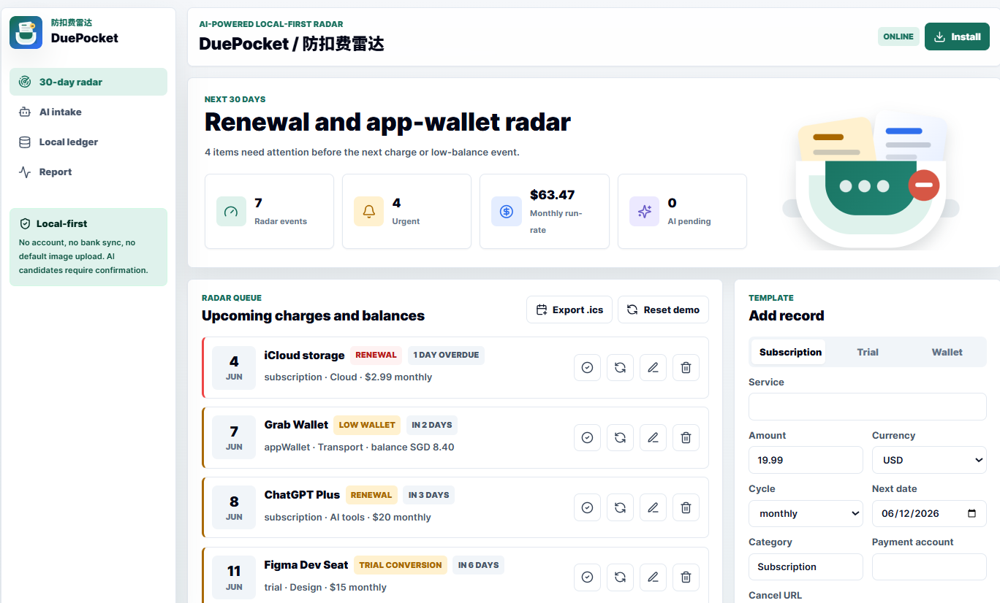

# DuePocket / 防扣费雷达

AI-powered local-first renewal and app-wallet radar.

[Live Demo](https://jiaye1998.github.io/duepocket/) · [Case Study](docs/CASE_STUDY.md)



DuePocket helps users catch upcoming subscriptions, trial conversions, and low app-wallet balances before money leaves.

It is designed as a privacy-first AI product engineering demo: no account, no bank sync, local IndexedDB storage, AI extraction candidates, human confirmation, and a bilingual evaluation harness.

## Demo Scope

- 30-day renewal radar for subscriptions, trials, and app-wallet balances
- Local-first IndexedDB ledger with demo data
- AI-assisted one-line intake with structured extraction candidates
- Screenshot OCR flow through local `tesseract.js`
- Human confirmation before AI candidates enter the ledger
- Calendar `.ics` export
- JSON backup and restore
- Monthly savings report with per-currency run-rate totals
- Offline app shell via service worker

## Tech Stack

- Vite
- React
- TypeScript
- Tailwind CSS
- IndexedDB through `idb`
- PWA manifest and service worker
- `tesseract.js` for local OCR demo

## Run Locally

```powershell
npm.cmd install --cache .\.npm-cache
npm.cmd run dev
```

Open the local URL printed by Vite, usually `http://127.0.0.1:5173/`.

## Build

```powershell
npm.cmd run build
```

## Privacy Boundary

DuePocket intentionally does **not** include bank sync, account login, automatic cancellation, investment analysis, or financial advice. Screenshots and AI candidates remain local by default. The AI parser creates candidates only; users must confirm the structured fields before data is saved.

## Evaluation

The demo includes a 50-sample bilingual extraction dataset in `data/ai-eval-samples.json`. The app runs the current parser against those samples at runtime, then displays real field accuracy, average confidence, and failure cases.

## Use as a Claude Code Skill

DuePocket also ships as a headless [Claude Code](https://claude.com/claude-code) skill. Claude becomes the parser: you paste a subscription line or hand it a screenshot, Claude extracts the details and asks you to confirm, then a bundled **zero-dependency** Node script stores them and computes the radar. The skill shares the PWA's backup format, so data moves both ways between the browser app and the skill.

Install by copying the skill into your personal skills folder:

```powershell
Copy-Item -Recurse skills\duepocket "$env:USERPROFILE\.claude\skills\duepocket"
```

```bash
cp -r skills/duepocket ~/.claude/skills/duepocket
```

Then, in Claude Code:

> **You:** Netflix renews 2026-07-01 at S$19.98/month
> **Claude:** extracts the renewal, shows it for confirmation, then saves it to a local ledger.
> **You:** show my renewal radar
> **Claude:** lists what's due in the next 30 days, with per-currency monthly run-rate on request.

The ledger lives at `~/.duepocket/ledger.json` (override with `--ledger` or `DUEPOCKET_LEDGER`) and uses the same format as the app's JSON backup, so you can `export` from the skill and **Restore** it in the PWA, or export from the PWA and `import` it into the skill. The deterministic engine has a smoke test: `node skills/duepocket/test.mjs`.

## 中文说明

DuePocket / 防扣费雷达不是传统记账 App，而是一个本地优先的续费、试用转付费和 App 余额提醒工具。第一版重点展示 AI 产品工程能力：隐私边界、AI 候选确认流程、评测意识、PWA 工程化和可演示的完整闭环。
